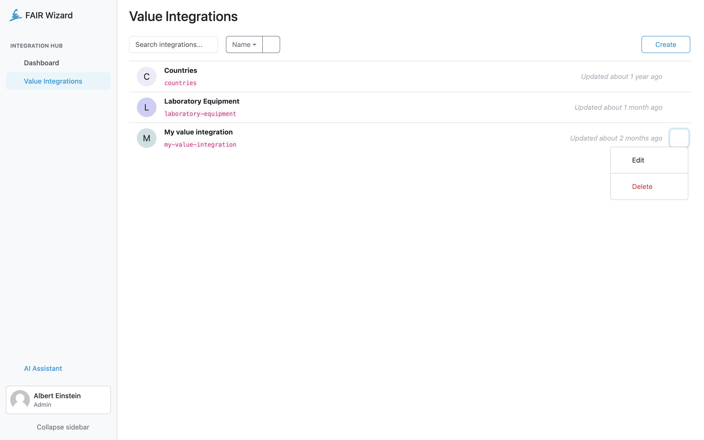

.. _value-integrations:

Value Integrations
******************

Users with the :ref:`Use Integration Hub<roles>` role permission can use value integration to set up an integration to be used in knowledge models as a source of data.

We can start creating a new value integration by clicking on the :guilabel:`Create` button.

    Value integrations.

----

.. raw:: html

    <h2>Table of Contents</h2>

.. toctree::
    :maxdepth: 2

    Create<create>
    Detail<detail>
