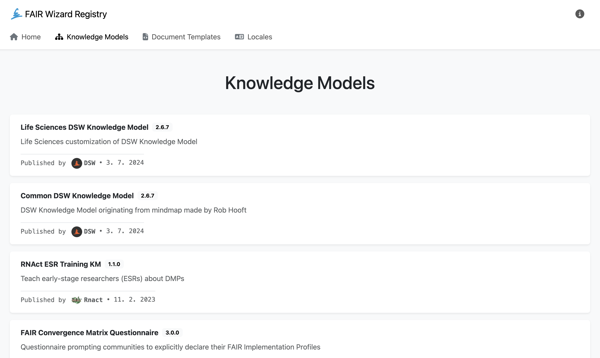

.. _fw-registry:

FAIR Wizard Registry
********************

`FAIR Wizard Registry <https://registry.fair-wizard.com/>`_ is a place where we publish knowledge models, document templates and locales. It is very easy to get those into a |project_name| and use.

    
    FAIR Wizard Registry with a list of knowledge models.

Registry allows us to:

- :ref:`Import knowledge models from FAIR Wizard Registry<km-import-from-registry>`
- :ref:`Import document templates from FAIR Wizard Registry<doc-template-import-from-registry>`
- :ref:`Import locales from FAIR Wizard Registry<locale-import-from-registry>`
